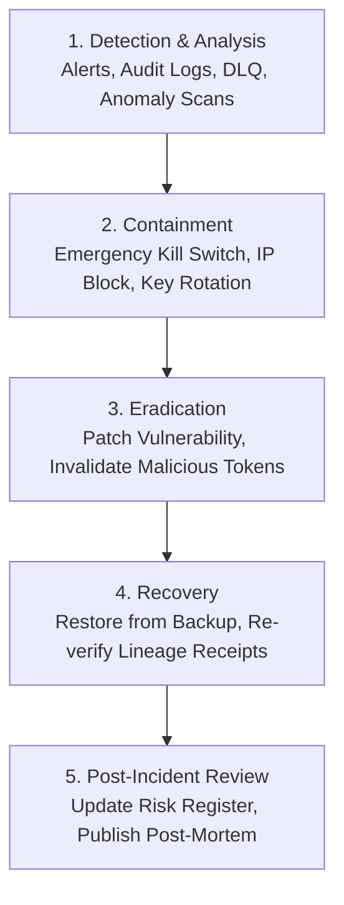

# VIREONIQ X — Incident Response Plan & Security Playbooks

**Version**: `16.0.0-rc1`  
**Classification**: `INTERNAL / INCIDENT RESPONSE`  
**Standard**: `NIST SP 800-61 Rev. 2 (Computer Security Incident Handling Guide)`  
**Audit Status**: `CERTIFIED & OPERATIONAL`

---

## 1. Incident Lifecycle & Response Workflow



---

## 2. Severity Classification & Escalation Matrix

| Level | Criteria | Escalation Target | SLA |
| :--- | :--- | :--- | :--- |
| **SEV-0 (CRITICAL)** | Signing key compromise, active cross-tenant data leak, total database outage | CTO, Security Architect, Legal | 15 minutes |
| **SEV-1 (HIGH)** | AI model outage, autonomous guard bypass attempt, mass webhook delivery failure | SecOps On-Call, Backend Lead | 30 minutes |
| **SEV-2 (MEDIUM)** | Single IDOR authorization attempt, rate-limit threshold anomaly | Security Engineer | 2 hours |
| **SEV-3 (LOW)** | Minor dependency warning, single transient API timeout | Support / DevSecOps | 12 hours |

---

## 3. Incident Playbooks

### Playbook A: Autonomous Agent Anomaly / Runaway Loop
1. **Containment**: Trigger the global emergency kill switch:
   ```sql
   UPDATE automation_preferences SET kill_switch_active = TRUE;
   ```
2. **Analysis**: Inspect `SecurityAuditLog` for `HIGH_IMPACT_ACTION_BLOCKED` or repeated recommendation dispatch.
3. **Remediation**: Reset the user action queue and re-verify Level 3 guardrails.

### Playbook B: Credential Signing Key Compromise
1. **Containment**: Rotate `CREDENTIAL_SIGNING_KEY` environment secret immediately.
2. **Analysis**: Query `SecurityAuditLog` for all `CREDENTIAL_ISSUED` events within the compromise window.
3. **Remediation**: Invalidate compromised signatures, bump `key_version` to `v2.0`, and re-mint valid credentials.
4. **Notification**: Issue transparency notification to affected candidates and verifying employers.

### Playbook C: Webhook Delivery Outage & Dead Letter Queue (DLQ) Recovery
1. **Analysis**: Inspect `webhook_delivery_logs` where `status = 'FAILED'`.
2. **Remediation**: Once the partner endpoint is restored, re-dispatch events from the DLQ:
   ```python
   await retry_dead_letter_queue_events(db=db_session)
   ```

---

<div align="center">
  <sub>© 2026 VIREONIQ (PLACEIQ) — Incident Response Plan</sub>
</div>
