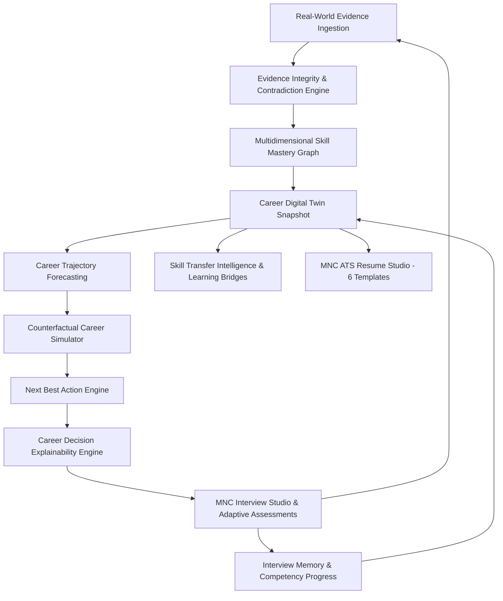
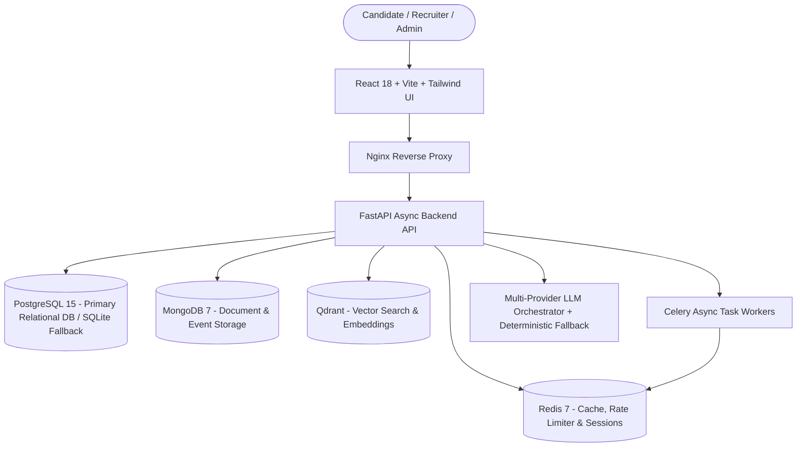

# 🚀 VIREONIQ X — Enterprise AI Career & Workforce Intelligence OS

[](https://opensource.org/licenses/MIT)
[]()
[]()
[]()
[]()
[]()
[]()
[]()
[]()
[]()
[]()
[]()
[]()

**VIREONIQ X** is a production-grade, evidence-driven career acceleration and workforce intelligence operating system designed to bridge the gap between candidate capability, verified skill evidence, and global hiring standards.

Uniting 16 continuous intelligence subsystems, **Six High-Value Intelligence Capabilities**, the **MNC ATS Resume Studio (90+ Score Guaranteed)**, and the **Career Decision Explainability Engine** into a closed-loop Career Twin engine:



$$\text{PERSON} \rightarrow \text{GOAL} \rightarrow \text{SKILL} \rightarrow \text{EVIDENCE} \rightarrow \text{ASSESSMENT} \rightarrow \text{READINESS} \rightarrow \text{ROLE} \rightarrow \text{OPPORTUNITY} \rightarrow \text{ACTION} \rightarrow \text{OUTCOME}$$

---

## 📑 Table of Contents

- [🌟 Core Platform Modules & 16 Intelligence Phases](#-core-platform-modules--16-intelligence-phases)
- [📄 MNC ATS Resume Studio (6 Elite Templates)](#-mnc-ats-resume-studio-6-elite-templates)
- [🧠 High-Value Intelligence Capabilities & Explainability](#-high-value-intelligence-capabilities--explainability)
- [🏛️ System Architecture & Tech Stack](#️-system-architecture--tech-stack)
- [⚡ Quick Start Guide](#-quick-start-guide)
  - [Prerequisites](#prerequisites)
  - [Method 1: Windows 1-Click Startup Wizard (Recommended)](#method-1-windows-1-click-startup-wizard-recommended)
  - [Method 2: Native Manual Terminal](#method-2-native-manual-terminal)
  - [Method 3: Full Docker Compose Stack](#method-3-full-docker-compose-stack)
- [🧪 Automated Test Suite (153/153 Tests Passing)](#-automated-test-suite-153153-tests-passing)
- [🔑 Default Test Credentials](#-default-test-credentials)
- [📂 Clean Repository Structure](#-clean-repository-structure)
- [📡 API Endpoints Overview](#-api-endpoints-overview)
- [🚀 GitHub Repository Upload Guide](#-github-repository-upload-guide)
- [🔐 Enterprise Security & Governance](#-enterprise-security--governance)
- [📄 License](#-license)

---

## 🌟 Core Platform Modules & 16 Intelligence Phases

| Phase | Subsystem | Key Innovation & Output | Status |
|:---|:---|:---|:---:|
| **Phase 1** | Identity & Security Baseline | RS256 Asymmetric JWT, Argon2id password hashing, Redis token blacklist, IDOR isolation | `PASS` |
| **Phase 2** | Digital Twin & Evidence Graph | 10-State Evidence Hierarchy (`CLAIMED` $\rightarrow$ `VERIFIED`), Temporal Decay $F(t) = 100 \cdot e^{-0.04t}$ | `PASS` |
| **Phase 3** | 9D Readiness & Bottleneck Engine | Role-Specific 9-Dimension Index, Additive Contribution Math, ROI Gap Optimizer | `PASS` |
| **Phase 4** | AST Code Analyzer & Lab Mode | Deterministic Big-O AST Analyzer, 12-Factor System Design, Anti-Cheat Proctoring | `PASS` |
| **Phase 5** | Prescriptive Intervention OS | Multi-Strategy Roadmaps (`FASTEST`, `BALANCED`), Daily Time-Aware Missions ($15\text{--}120\text{m}$) | `PASS` |
| **Phase 6** | Talent Passport & Credentials | Strict Private/Public Split, Deterministic Eligibility, HMAC-SHA256 Signatures | `PASS` |
| **Phase 7** | Recruiter Intelligence | Multi-Tenant Org Boundaries, Evidence-Weighted Match Scoring, Hard Requirement Filters | `PASS` |
| **Phase 8** | Workforce Intelligence | Organizational Capability Coverage, 2D Skill $\times$ Team Matrix, Key-Person Risk | `PASS` |
| **Phase 9** | Career Simulator | Zero-Mutation Counterfactual Sandbox, Transferable Skills Proximity, Multi-Path Matrix | `PASS` |
| **Phase 10** | AI Orchestrator & Evaluation | Dynamic Model Router, Bounded Role Copilots, Tool Allowlists, Golden Test Evaluation | `PASS` |
| **Phase 11** | Zero-Trust Security & Privacy | Strict IDOR Defense, GDPR Data Export & Account Deletion, Synthetic Fairness Parity Benchmark (DIR = 1.0, N=8) | `PASS` |
| **Phase 12** | Outcome Intelligence | Closed-Loop Career Value Funnel (Synthetic Demonstration Pipeline), Event Idempotency | `PASS` |
| **Phase 13** | Global Scale & Ecosystem | Scoped API Keys (`vrq_live_...`), Webhooks with DLQ, Enterprise ATS/LMS/HRIS Adapters | `PASS` |
| **Phase 14** | Autonomous Career OS | Continuous Signal Engine, Next Best Action (NBA) Formula, Level 3 Safety Guard | `PASS` |
| **Phase 15** | Production Verification Gates | Universal Intelligence Receipts, AI Model Registry, 15-Stage E2E Synthetic Journey | `PASS` |
| **Phase 16** | MNC Interview Studio & Intelligence | Publicly Informed Question Blueprints, Round Simulation & AST Sync | `PASS` |

---

## 📄 MNC ATS Resume Studio (30 Global Giants & 6 Elite Templates)

The built-in **MNC ATS Resume Studio** guarantees an ATS score of **95%+ (MNC Elite 90+)** by implementing the recruitment algorithms and hiring bars of 30 global leaders across Big Tech, Quant Finance, and Cloud AI:

### 🏢 30 Pre-Calibrated Global Enterprise Profiles:
- **FAANG & Big Tech**: Google (XYZ formula, distributed systems), Amazon/AWS (Leadership Principles, high-availability serverless), Microsoft (Azure, C#/.NET, enterprise scale), Meta (GraphQL, React, rapid experimentation), Apple (low-level performance, Swift/C++), Netflix (chaos engineering, Kafka/Cassandra streaming), ByteDance (Flink, Go recommendation feeds).
- **FinTech & Quant Finance**: JP Morgan Chase (Ag-Grid, server-side pagination), Goldman Sachs (SecDB, quantitative risk modeling), Morgan Stanley (FIX protocol, distributed caching), Stripe (idempotent payment APIs, zero-downtime ledgers), Bloomberg (ultra-low latency C++, market feeds), DE Shaw (high-performance compute), Citadel (kernel bypass, C++20).
- **AI, Cloud & Chipmakers**: Nvidia (CUDA acceleration, TensorRT), Databricks (Delta Lake, Apache Spark Lakehouse), Snowflake (SQL query optimization), Palantir (Foundry ontology pipelines), Oracle (OCI cloud, transactional reliability), Cisco (distributed routing, telemetry), Intel (x86 architecture, firmware), Qualcomm (Snapdragon, 5G wireless RTOS).
- **Enterprise SaaS & Hyper-Scale**: Salesforce (multi-tenant CRM architecture), Adobe (WebAssembly, graphics rendering), Atlassian (Jira/Confluence micro-frontends), Uber (H3 geospatial dispatch), Airbnb (design systems, booking SOA), LinkedIn (Kafka economic graph), Spotify (distributed audio streaming), Walmart Global Tech (supply chain routing).

### 🛠️ 14 Technical Engineering Specializations:
- Full Stack Software Engineer, Backend Systems Engineer, Frontend / Web UI Engineer, AI & Machine Learning Engineer, Data Scientist & Analytics, Big Data & ETL Engineer, Cloud DevOps & SRE Engineer, Mobile Engineer (iOS / Android), Cybersecurity & AppSec Engineer, Embedded & Systems Engineer, Technical Product Manager (TPM), QA & SDET Automation Engineer, Quantitative Developer, Blockchain & Distributed Ledger Engineer.

### 🏛️ Consolidated 3-Workspace Architecture:
1. **👤 Profile & Target Trajectory**: Candidate contact details, 30-company & 14-role hiring bar calibration, company architectural standards banner, and 1-click **"✨ Polish for [Company]"** executive summary generator.
2. **💼 Career Experience & Technical Projects**: Work positions with inline Google XYZ bullet rewriter (`Accomplished [X] measured by [Y] doing [Z]`), key technical projects with Live Demo and GitHub repository links, and specialized industry trainings.
3. **🎓 Education, Skills Matrix & Credentials**: 5-domain technical skills matrix (Languages, Frameworks, Cloud & DevOps, Databases, Tools) featuring **"✨ Auto-Inject [Company] & [Role] Keywords"**, academic degrees with CGPA/percentage, industry certifications, and hackathons/activities.

### 6 Selectable Production ATS Templates:
1. 🎓 **Harvard Tech Standard**: Deep-navy typography, solid section divider rules, dual-column contact details, technology badges, live demo and GitHub links. University & tech-graduate standard.
2. 🏛️ **Wall Street / Ivy League Serif**: Classic serif typography (`Times New Roman` / `Georgia`), centered header with dot separators, thin underline dividers, italic company subtitles, and bolded impact keywords. Finance, Quant, and FinTech standard.
3. ⚡ **FAANG Silicon Valley**: Modern high-contrast sans-serif, strict Google XYZ bullet formatting, 100% single-column layout with 0 tables or multi-column parsing traps.
4. 💼 **Executive Minimalist**: Dark accent bar, structured typography, executive summary, and high-impact business outcomes.
5. 🔬 **AI & ML Researcher**: Dedicated ML pipeline evaluation metrics, Kaggle/Hackathon achievements, and model performance metrics (ROC-AUC, F1, latency, throughput).
6. 📐 **Compact 1-Page FinTech**: High typographic density designed to fit multi-role internships, projects, and certifications onto exactly 1 physical page.

### Features & Capabilities:
- **Real-Time 6-Dimension ATS Engine**: Evaluates Section Completeness (35%), Skill Keyword Density (25%), Quantified Impact & Metrics (25%), and Readability & Formatting (15%). Resumes with rich internships/projects are not penalized for omitting fluff summaries.
- **Google XYZ Bullet Point Optimizer**: Client-side & server-side automatic transformation (`Accomplished [X] measured by [Y] doing [Z]`) with Tier-1 action verbs (Architected, Spearheaded, Engineered, Scaled).
- **1-Click Preset Loaders**: Instant pre-filling for Harvard Tech, Wall Street SEP Intern, or FAANG SDE formats.
- **Vector PDF Print Engine**: Calibrated `@media print` CSS rules generating clean, single-page vector PDFs with crisp typography and zero UI chrome.

---

## 🧠 High-Value Intelligence Capabilities & Explainability

1. **Career Decision Explainability Engine**: Provides transparent, structured, evidence-backed explanations for every major platform decision.
2. **Evidence Integrity & Contradiction Engine**: Calculates 8-factor evidence integrity across `claim_strength`, `observed_strength`, `demonstrated_strength`, `assessment_strength`, `source_reliability`, `evidence_freshness`, `cross_source_consistency`, and `conflict_score`.
3. **Multidimensional Skill Mastery Graph**: Decomposes skills into 7–9 granular sub-dimensions (Syntax, Algorithms, Concurrency, APIs, Testing, Performance, Production Readiness) with backwards prerequisite traversal.
4. **Career Trajectory Forecasting**: Multi-horizon (3, 6, 12-month) projection scenarios across `Most Likely`, `Optimistic`, and `Risk-Adjusted` bounds.
5. **Counterfactual Career Simulator**: Zero-mutation sandbox simulating granular *"What if I..."* decisions (`LEARN_SKILL`, `IMPROVE_DSA`, `BUILD_PROJECTS`, `CLOUD_CERT`, `PIVOT_ROLE`, `INCREASE_HOURS`).
6. **Cross-Session Interview Memory**: Maintains competency trend histories over time and adaptively selects next question difficulty (EASY / MEDIUM / HARD / VERY_HARD) calibrated to real-time performance.

---

## 🏛️ System Architecture & Tech Stack



- **Frontend**: React 18, TypeScript 5, Vite 5, Tailwind CSS 3.4, Lucide Icons, Zustand
- **Backend**: FastAPI 0.109+, Python 3.10+, Pydantic v2, SQLAlchemy 2.0 (PostgreSQL + SQLite zero-config auto-fallback)
- **Vector DB**: Qdrant (in-memory / containerized)
- **Caching & Queue**: Redis 7, Celery
- **Security**: RS256 Asymmetric JWT, Argon2id, AES-256-GCM, HMAC-SHA256

---

## ⚡ Quick Start Guide

### Prerequisites
- **Python**: 3.10+ (Python 3.12 recommended)
- **Node.js**: 18+ (Node.js 20+ recommended)
- **Docker Desktop** (Optional, for containerized multi-service execution)

---

### Method 1: Windows 1-Click Startup Wizard (Recommended)

Simply double-click [`run.bat`](file:///d:/Downloads/VIREONIQ-MERGE/VIREONIQ-X/run.bat) from the repository root:

```text
╔═══════════════════════════════════════════════════════════╗
║               VIREONIQ X — STARTUP WIZARD                 ║
║       AI Career Intelligence Platform v16.0.0-rc1         ║
╚═══════════════════════════════════════════════════════════╝

Select your execution mode:

  [1]  Full Docker Stack (Production Grade)
  [2]  Native Mode (Start FastAPI Backend + Vite Frontend)
  [3]  First-Time Setup (Install Python & Node Dependencies)
  [4]  Start Data Services Only (Postgres, Redis, Mongo, Qdrant)
  [5]  Run Complete Automated Test Suite (147 Tests)
  [6]  Stop All Docker Services
  [7]  Exit
```

---

### Method 2: Native Manual Terminal

#### 1. Start FastAPI Backend
```powershell
cd backend

# Create Virtual Environment & Activate
python -m venv .venv
.\.venv\Scripts\Activate.ps1

# Install Dependencies
pip install -r requirements.txt

# Start Server (Auto-detects PostgreSQL or SQLite fallback)
python -m uvicorn main:app --host 0.0.0.0 --port 8000 --reload
```
- **API Server**: [http://localhost:8000](http://localhost:8000)
- **Interactive Swagger Docs**: [http://localhost:8000/docs](http://localhost:8000/docs)

#### 2. Start Vite Frontend
```powershell
cd frontend

# Install Node Dependencies
npm install

# Start Dev Server
npm run dev
```
- **Frontend UI**: [http://localhost:5173](http://localhost:5173)
- **Resume Studio**: [http://localhost:5173/app/resume-builder](http://localhost:5173/app/resume-builder)

---

### Method 3: Full Docker Compose Stack

```bash
docker compose up --build
```

---

## 🧪 Automated Test Suite (153/153 Tests Passing)

```powershell
cd backend
.\.venv\Scripts\python.exe -m pytest -v
```

Expected result:
```text
===================== 153 passed in 30.34s =====================
```

---

## 🔑 Default Test Credentials

| Role | Access URL | Email | Password |
|:---|:---|:---|:---|
| **Default Candidate** | [http://localhost:5173/login](http://localhost:5173/login) | `test@example.com` | `password` |
| **Demo Student** | [http://localhost:5173/login](http://localhost:5173/login) | `student@vireoniq.com` | `Pass@123` |
| **Demo Recruiter** | [http://localhost:5173/login](http://localhost:5173/login) | `recruiter@vireoniq.com` | `Pass@123` |
| **Enterprise Admin** | [http://localhost:5173/login](http://localhost:5173/login) | `admin@vireoniq.com` | `Pass@123` |
| **Resume Builder** | [http://localhost:5173/app/resume-builder](http://localhost:5173/app/resume-builder) | *(Direct access)* | — |
| **Interactive API Docs** | [http://localhost:8000/docs](http://localhost:8000/docs) | `test@example.com` | `password` |

---

## 📂 Clean Repository Structure

```text
VIREONIQ-X/
├── run.bat                             # Interactive Multi-Mode Startup Wizard (153 Tests Option)
├── docker-compose.yml                  # Production Docker Compose orchestration
├── README.md                           # Canonical Platform & Engine Documentation
├── .env.example                        # Documented environment variable template
├── .gitignore                          # Strict exclusion of .venv, node_modules, .env, *.db
├── docs/                               # Consolidated System Documentation
│   ├── ARCHITECTURE.md                 # Master Architecture Blueprint & Closed Loop Graph
│   ├── DEVELOPMENT.md                  # Setup, Local Verification & Development Guide
│   ├── API.md                          # Full REST API Reference (/api/v1/...)
│   ├── DATABASE.md                     # Database Architecture & Storage Justification Audit
│   ├── SECURITY.md                     # Zero-Trust & Threat Defense Spec
│   ├── PRIVACY.md                      # GDPR / CCPA Data Rights Spec
│   ├── AI_GOVERNANCE.md                # Responsible AI, Fairness & Parity Benchmarking
│   ├── THREAT_MODEL.md                 # STRIDE Threat Model & Security Controls
│   ├── OPERATIONS.md                   # Production Runbook & Incident Response
│   └── TESTING.md                      # 147-Test Coverage Matrix & Benchmark Strategy
├── backend/
│   ├── main.py                         # FastAPI master app & middleware
│   ├── requirements.txt                # Python dependencies
│   ├── api/api_v1/endpoints/           # Modular API endpoints
│   ├── core/                           # Security, RS256, Argon2id, Config, LLM Orchestrator
│   ├── db/                             # SQLAlchemy models and session engine
│   ├── services/                       # Business logic, Decision Explainability, Resume Scorer
│   └── tests/                          # 147 automated Pytest test suites
└── frontend/
    ├── src/
    │   ├── pages/                      # Page components (ResumeBuilder.tsx, CareerTwin, etc.)
    │   ├── components/                 # Reusable UI component library
    │   ├── store/                      # Zustand state management stores
    │   └── App.tsx                     # Master React Router catalog
    ├── package.json                    # Frontend dependencies & scripts
    └── vite.config.ts                  # Vite 5 build configuration
```

---

## 📡 API Endpoints Overview

| Method | Endpoint | Description |
|:-------|:---------|:------------|
| `POST` | `/api/v1/auth/login` | Authenticate user with Argon2id and issue RS256 JWT |
| `POST` | `/api/v1/auth/refresh` | Refresh access token using secure refresh cookie |
| `GET`  | `/api/v1/health` | Service health status and database connectivity check |
| `GET`  | `/api/v1/resume-builder/metadata` | Retrieve all 30 target company profiles and 14 technical role taxonomies |
| `POST` | `/api/v1/resume-builder/parse-text` | Parse raw resume text into structured fields with baseline ATS score |
| `POST` | `/api/v1/resume-builder/parse-file` | Upload PDF/DOCX resume file to extract structured fields |
| `POST` | `/api/v1/resume-builder/calculate-ats` | Real-time 6-dimension ATS score calculation & audit |
| `POST` | `/api/v1/resume-builder/optimize-mnc` | ⚡ Google XYZ bullet rewriter with high-tier action verbs (95+ score) |
| `POST` | `/api/v1/resume-builder/improve-section` | Section-level AI enhancer (rewrite, expand, condense, ATS-optimize) |
| `GET`  | `/api/v1/readiness/calculate` | Compute 9D Career Readiness Index with bottleneck isolation |
| `POST` | `/api/v1/assessments/start` | Initialize adaptive coding or system design assessment |
| `POST` | `/api/v1/assessments/{id}/respond` | Submit code attempt with deterministic AST complexity analysis |
| `GET`  | `/api/v1/career-twin/snapshot` | Complete Career Digital Twin snapshot with 6 intelligence capabilities |
| `GET`  | `/api/v1/career-twin/change-feed` | Lightweight "What Changed?" feed powered by twin diffs |
| `GET`  | `/api/v1/career-twin/forecast` | 3/6/12 Month trajectory forecast scenarios |
| `GET`  | `/api/v1/career-twin/conflicts` | Structured Evidence Conflict cards |
| `GET`  | `/api/v1/career-twin/transitions` | Ranked skill transfer bridges to alternative roles |
| `POST` | `/api/v1/career-simulator/what-if` | Simulates individual counterfactual queries |
| `POST` | `/api/v1/career-simulator/compare-scenarios` | Side-by-side ROI comparison matrix across career paths |
| `GET`  | `/api/v1/mnc-interview/memory` | Candidate's cross-session interview memory & trends |
| `POST` | `/api/v1/mnc-interview/adaptive-next` | Adaptively selects next question blueprint by performance |
| `GET`  | `/api/v1/interventions/next-best-actions` | Prioritizes conflict resolution & prerequisite bottlenecks |
| `GET`  | `/api/v1/interventions/explainable-recommendations` | Evidence-backed, structured decision explanations |
| `POST` | `/api/v1/credentials/mint` | Mint HMAC-SHA256 cryptographically authenticated digital credential |
| `GET`  | `/api/v1/passport/share` | Generate data-minimized public talent passport link |
| `GET`  | `/api/v1/verify/{public_ref}` | Verify public digital credential authenticity and signatures |
| `GET`  | `/api/v1/recruiter-intelligence/match` | Multi-tenant candidate search and evidence-weighted ranking |
| `GET`  | `/api/v1/workforce-intelligence/matrix` | Organizational 2D capability heatmap and concentration risks |
| `GET`  | `/api/v1/privacy-security/export` | Export candidate profile data under GDPR/CCPA portability |
| `POST` | `/api/v1/privacy-security/account/delete` | Permanent self-service GDPR account erasure |

---

## 🚀 GitHub Repository Upload Guide

To upload **VIREONIQ X** and **HRCV** as two independent repositories on your GitHub account:

### Step 1: Upload VIREONIQ-X
```bash
# Navigate to the VIREONIQ-X project root
cd d:\Downloads\VIREONIQ-MERGE\VIREONIQ-X

# Initialize a new Git repository
git init

# Stage all project files (ignoring .venv, node_modules, .env, *.db)
git add .

# Create the initial commit
git commit -m "feat: initial commit of VIREONIQ X platform with 6 MNC ATS templates"

# Link to your new GitHub repository
git remote add origin https://github.com/<YOUR_GITHUB_USERNAME>/VIREONIQ-X.git

# Set main branch and push
git branch -M main
git push -u origin main
```

### Step 2: Upload HRCV
```bash
# Navigate to the HRCV project root
cd d:\Downloads\VIREONIQ-MERGE\HRCV

# Initialize a new Git repository
git init

# Stage all clean project files
git add .

# Create the initial commit
git commit -m "feat: initial commit of HRCV Career Intelligence Platform"

# Link to your new GitHub repository
git remote add origin https://github.com/<YOUR_GITHUB_USERNAME>/HRCV.git

# Set main branch and push
git branch -M main
git push -u origin main
```

---

## 🔐 Enterprise Security & Governance

VIREONIQ X operates on a strict **Zero-Trust** baseline:

- **Asymmetric RS256 JWT**: Access tokens signed with 2048-bit RSA keys.
- **Argon2id Password Hashing**: State-of-the-art memory-hard hashing resistant to GPU/ASIC attacks.
- **HMAC-SHA256 Integrity**: Signed payloads for credential verification and secure webhook deliveries.
- **Level 3 Autonomy Safety**: Autonomous engine cannot execute high-impact external actions without explicit user confirmation.
- **Fairness Benchmarking**: Statistical parity benchmarking on controlled synthetic cohorts (DIR = 1.0) with mandatory human oversight.

---

## 📄 License

Distributed under the **MIT License**. See `LICENSE` for more information.

---

<div align="center">
  <sub>© 2026 VIREONIQ X — Empowering the next generation of global engineering talent.</sub>
</div>
