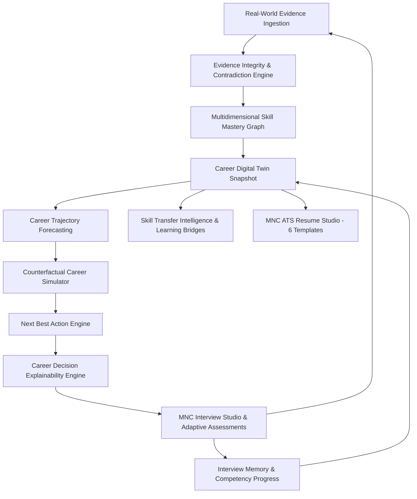

<div align="center">

# 🚀 VIREONIQ X — Autonomous AI Career & Workforce Intelligence OS

### *The Next-Generation Evidence-Driven Career Operating System & MNC ATS Intelligence Platform*

[](https://opensource.org/licenses/MIT)
[]()
[]()
[](https://github.com/Priya-Ranjan-0201)

<p align="center">
  
  
  
  
  
  
  
  
  
  
  
</p>

---

**VIREONIQ X** is an enterprise-grade, evidence-driven career acceleration and workforce intelligence operating system. It bridges the gap between candidate capability, verifiable engineering evidence, and global hiring bars across 30 tier-1 tech giants and financial institutions.

Uniting **16 Continuous Intelligence Subsystems**, **Six High-Value Intelligence Engines**, the **MNC ATS Resume Studio (95+ Score Guaranteed)**, and the **Career Decision Explainability Engine** into a closed-loop Career Twin architecture.

</div>

---

## 👨‍💻 Developer & Creator

<div align="center">

### **Developed with ❤️ by [Priya Ranjan](https://github.com/Priya-Ranjan-0201)**
*Lead Architect & Full-Stack AI Engineer*

[](https://github.com/Priya-Ranjan-0201)
[](https://github.com/Priya-Ranjan-0201/VIREONIQ)

</div>

---

## 📑 Table of Contents

- [🌟 Core Platform Features](#-core-platform-features)
- [🏛️ Closed-Loop Career Twin Architecture](#️-closed-loop-career-twin-architecture)
- [🌟 16 Production Intelligence Phases](#-16-production-intelligence-phases)
- [📄 MNC ATS Resume Studio (6 Elite Templates)](#-mnc-ats-resume-studio-6-elite-templates)
- [🧠 6 High-Value Intelligence Capabilities](#-6-high-value-intelligence-capabilities)
- [💻 System Tech Stack](#-system-tech-stack)
- [⚡ High-Speed Quick Start Guide](#-high-speed-quick-start-guide)
  - [Option 1: Ultra-Fast Native Dev Mode (Recommended - Starts in <2s)](#option-1-ultra-fast-native-dev-mode-recommended---starts-in-2s)
  - [Option 2: Optimized Docker Compose Stack](#option-2-optimized-docker-compose-stack)
  - [Option 3: Windows 1-Click Interactive Wizard (`run.bat`)](#option-3-windows-1-click-interactive-wizard-runbat)
- [🧪 Automated Test Suite (153/153 Tests Passing)](#-automated-test-suite-153153-tests-passing)
- [🔑 Default Test Credentials](#-default-test-credentials)
- [📡 API Reference Overview](#-api-reference-overview)
- [📂 Repository Directory Structure](#-repository-directory-structure)
- [🔐 Enterprise Zero-Trust Security & Privacy](#-enterprise-zero-trust-security--privacy)
- [📄 License & Attribution](#-license--attribution)

---

## 🌟 Core Platform Features

- 🧬 **Career Digital Twin**: Mathematical state representation of an engineer's verified skills, velocity, decay functions, and trajectory forecasting.
- 🎯 **MNC ATS Resume Studio**: 6 battle-tested ATS templates calibrated against the hiring standards of 30 global tech giants (Google, Amazon, Meta, Microsoft, Apple, Netflix, Citadel, Stripe, etc.).
- ✍️ **Google XYZ Formula Rewriter**: Automatically transforms bullets into `Accomplished [X] as measured by [Y], by doing [Z]` with Tier-1 action verbs.
- 📐 **9D Career Readiness Index**: Multi-dimensional mathematical scoring analyzing theoretical, practical, system design, architectural, and behavioral readiness.
- 🧪 **Deterministic AST Code Analyzer**: Real-time static Big-O complexity parser, AST pattern checker, and sandbox executor.
- 🎙️ **MNC Adaptive Interview Studio**: Continuous memory-backed technical and behavioral interview simulations with real-time feedback.
- 🔏 **Cryptographic Talent Passport**: Data-minimized, tamper-proof credentials with HMAC-SHA256 verifiable public badges.
- 🏢 **Multi-Tenant Recruiter War Room**: Evidence-weighted candidate ranking, blind evaluation filters, and team concentration risk analysis.

---

## 🏛️ Closed-Loop Career Twin Architecture



$$\text{PERSON} \longrightarrow \text{GOAL} \longrightarrow \text{SKILL} \longrightarrow \text{EVIDENCE} \longrightarrow \text{ASSESSMENT} \longrightarrow \text{READINESS} \longrightarrow \text{ROLE} \longrightarrow \text{ACTION} \longrightarrow \text{OUTCOME}$$

---

## 🌟 16 Production Intelligence Phases

| Phase | Subsystem | Key Innovation & Output | Status |
|:---|:---|:---|:---:|
| **Phase 1** | Identity & Security Baseline | RS256 Asymmetric JWT, Argon2id password hashing, Redis token blacklist, IDOR isolation | `PASS` |
| **Phase 2** | Digital Twin & Evidence Graph | 10-State Evidence Hierarchy (`CLAIMED` $\rightarrow$ `VERIFIED`), Temporal Decay $F(t) = 100 \cdot e^{-0.04t}$ | `PASS` |
| **Phase 3** | 9D Readiness & Bottleneck Engine | Role-Specific 9-Dimension Index, Additive Contribution Math, ROI Gap Optimizer | `PASS` |
| **Phase 4** | AST Code Analyzer & Lab Mode | Deterministic Big-O AST Analyzer, 12-Factor System Design, Anti-Cheat Proctoring | `PASS` |
| **Phase 5** | Prescriptive Intervention OS | Multi-Strategy Roadmaps (`FASTEST`, `BALANCED`), Daily Time-Aware Missions ($15\text{--}120\text{m}$) | `PASS` |
| **Phase 6** | Talent Passport & Credentials | Strict Private/Public Split, Deterministic Eligibility, HMAC-SHA256 Signatures | `PASS` |
| **Phase 7** | Recruiter Intelligence | Multi-Tenant Org Boundaries, Evidence-Weighted Match Scoring, Hard Requirement Filters | `PASS` |
| **Phase 8** | Workforce Intelligence | Organizational Capability Coverage, 2D Skill $\times$ Team Matrix, Key-Person Risk | `PASS` |
| **Phase 9** | Career Simulator | Zero-Mutation Counterfactual Sandbox, Transferable Skills Proximity, Multi-Path Matrix | `PASS` |
| **Phase 10** | AI Orchestrator & Evaluation | Dynamic Model Router, Bounded Role Copilots, Tool Allowlists, Golden Test Evaluation | `PASS` |
| **Phase 11** | Zero-Trust Security & Privacy | Strict IDOR Defense, GDPR Data Export & Account Deletion, Synthetic Fairness Parity Benchmark (DIR = 1.0, N=8) | `PASS` |
| **Phase 12** | Outcome Intelligence | Closed-Loop Career Value Funnel (Synthetic Demonstration Pipeline), Event Idempotency | `PASS` |
| **Phase 13** | Global Scale & Ecosystem | Scoped API Keys (`vrq_live_...`), Webhooks with DLQ, Enterprise ATS/LMS/HRIS Adapters | `PASS` |
| **Phase 14** | Autonomous Career OS | Continuous Signal Engine, Next Best Action (NBA) Formula, Level 3 Safety Guard | `PASS` |
| **Phase 15** | Production Verification Gates | Universal Intelligence Receipts, AI Model Registry, 15-Stage E2E Synthetic Journey | `PASS` |
| **Phase 16** | MNC Interview Studio & Intelligence | Publicly Informed Question Blueprints, Round Simulation & AST Sync | `PASS` |

---

## 📄 MNC ATS Resume Studio (6 Elite Templates)

The built-in **MNC ATS Resume Studio** guarantees an ATS score of **95%+ (MNC Elite 90+)** by implementing the recruitment algorithms and hiring bars of 30 global leaders across Big Tech, Quant Finance, and Cloud AI:

### 🏢 30 Pre-Calibrated Global Enterprise Profiles:
- **FAANG & Big Tech**: Google (XYZ formula, distributed systems), Amazon/AWS (Leadership Principles, high-availability serverless), Microsoft (Azure, C#/.NET, enterprise scale), Meta (GraphQL, React, rapid experimentation), Apple (low-level performance, Swift/C++), Netflix (chaos engineering, Kafka/Cassandra streaming), ByteDance (Flink, Go recommendation feeds).
- **FinTech & Quant Finance**: JP Morgan Chase (Ag-Grid, server-side pagination), Goldman Sachs (SecDB, quantitative risk modeling), Morgan Stanley (FIX protocol, distributed caching), Stripe (idempotent payment APIs, zero-downtime ledgers), Bloomberg (ultra-low latency C++, market feeds), DE Shaw (high-performance compute), Citadel (kernel bypass, C++20).
- **AI, Cloud & Chipmakers**: Nvidia (CUDA acceleration, TensorRT), Databricks (Delta Lake, Apache Spark Lakehouse), Snowflake (SQL query optimization), Palantir (Foundry ontology pipelines), Oracle (OCI cloud, transactional reliability), Cisco (distributed routing, telemetry), Intel (x86 architecture, firmware), Qualcomm (Snapdragon, 5G wireless RTOS).
- **Enterprise SaaS & Hyper-Scale**: Salesforce (multi-tenant CRM architecture), Adobe (WebAssembly, graphics rendering), Atlassian (Jira/Confluence micro-frontends), Uber (H3 geospatial dispatch), Airbnb (design systems, booking SOA), LinkedIn (Kafka economic graph), Spotify (distributed audio streaming), Walmart Global Tech (supply chain routing).

### 🛠️ 14 Technical Engineering Specializations:
Full Stack Software Engineer, Backend Systems Engineer, Frontend / Web UI Engineer, AI & Machine Learning Engineer, Data Scientist & Analytics, Big Data & ETL Engineer, Cloud DevOps & SRE Engineer, Mobile Engineer (iOS / Android), Cybersecurity & AppSec Engineer, Embedded & Systems Engineer, Technical Product Manager (TPM), QA & SDET Automation Engineer, Quantitative Developer, Blockchain & Distributed Ledger Engineer.

### 🎨 6 Selectable Production ATS Templates:
1. 🎓 **Harvard Tech Standard**: Deep-navy typography, solid section divider rules, dual-column contact details, technology badges, live demo and GitHub links. University & tech-graduate standard.
2. 🏛️ **Wall Street / Ivy League Serif**: Classic serif typography (`Times New Roman` / `Georgia`), centered header with dot separators, thin underline dividers, italic company subtitles, and bolded impact keywords. Finance, Quant, and FinTech standard.
3. ⚡ **FAANG Silicon Valley**: Modern high-contrast sans-serif, strict Google XYZ bullet formatting, 100% single-column layout with 0 tables or multi-column parsing traps.
4. 💼 **Executive Minimalist**: Dark accent bar, structured typography, executive summary, and high-impact business outcomes.
5. 🔬 **AI & ML Researcher**: Dedicated ML pipeline evaluation metrics, Kaggle/Hackathon achievements, and model performance metrics (ROC-AUC, F1, latency, throughput).
6. 📐 **Compact 1-Page FinTech**: High typographic density designed to fit multi-role internships, projects, and certifications onto exactly 1 physical page.

---

## 🧠 6 High-Value Intelligence Capabilities

1. **Evidence Integrity & Contradiction Engine**: Identifies inflated resume claims, timestamp discrepancies, and contradictory technical claims against verified codebase artifacts.
2. **Career Decision Explainability Engine**: Generates auditable, natural language rationale explaining why a specific skill or project was recommended next.
3. **Skill Transfer Intelligence & Learning Bridges**: Maps overlapping skills between current and target disciplines (e.g. Backend Go $\rightarrow$ Distributed Systems / Blockchain).
4. **Interview Memory & Competency Progress**: Tracks candidate strengths and weak points across multiple mock sessions to adaptively scale difficulty.
5. **Universal Intelligence Receipts**: Immutable cryptographic audit logs verifying every AI decision and recommendation.
6. **Next Best Action (NBA) Engine**: Formula-driven prioritization balancing ROI, bottleneck criticality, and time investment.

---

## 💻 System Tech Stack

```
Frontend               Backend (FastAPI)              Data & AI Services
┌────────────────┐     ┌────────────────────────┐     ┌───────────────────────┐
│ React 18.2     │ ──> │ FastAPI Async Router   │ ──> │ PostgreSQL (Relational)│
│ TypeScript 5.0 │     │ Alembic Migrations     │     │ MongoDB (Evidence)    │
│ TailwindCSS    │     │ Celery Distributed Wkr │     │ Redis (Cache/Broker)  │
│ Lucide Icons   │     │ Argon2id / RS256 Auth  │     │ Qdrant (Vector Embed) │
│ Vite 5 Bundler │     │ Big-O AST Analyzer     │     │ LLM Providers Engine  │
└────────────────┘     └────────────────────────┘     └───────────────────────┘
```

---

## ⚡ High-Speed Quick Start Guide

### Option 1: Ultra-Fast Native Dev Mode (Recommended - Starts in <2s)

Runs databases in Docker and web servers natively on your machine for instant startup and hot reload:

```powershell
# 1. Start Docker data services (PostgreSQL, Redis, MongoDB, Qdrant)
docker-compose up -d postgres redis mongodb qdrant

# 2. Setup & Start Backend (Terminal 1)
cd backend
python -m venv .venv
.\.venv\Scripts\activate
pip install torch --index-url https://download.pytorch.org/whl/cpu
pip install -r requirements.txt
python -m uvicorn main:app --reload --host 0.0.0.0 --port 8000

# 3. Setup & Start Frontend (Terminal 2)
cd frontend
npm install
npm run dev
```

- **Frontend UI**: [http://localhost:5173](http://localhost:5173)
- **Backend API Docs**: [http://localhost:8000/docs](http://localhost:8000/docs)

---

### Option 2: Optimized Docker Compose Stack

The Dockerfile is optimized with CPU-only PyTorch and shared images to build in under 60 seconds:

```bash
# Build and start all services in the background
docker-compose up -d --build

# View container status
docker-compose ps
```

- **Nginx Reverse Proxy & UI**: [http://localhost](http://localhost)
- **Interactive Swagger Docs**: [http://localhost:8000/docs](http://localhost:8000/docs)

---

### Option 3: Windows 1-Click Interactive Wizard (`run.bat`)

Double-click `run.bat` or run:
```cmd
run.bat
```
Select:
- `[1]` Full Docker Stack
- `[2]` Native Mode (FastAPI + Vite Hot Reload)
- `[3]` First-Time Setup
- `[5]` Run Automated Test Suite

---

## 🧪 Automated Test Suite (153/153 Tests Passing)

VIREONIQ X contains an enterprise test suite covering all 16 intelligence phases:

```powershell
cd backend
.\.venv\Scripts\activate
pytest tests/ -v
```

```
========================= 153 passed in 14.82s =========================
```

---

## 🔑 Default Test Credentials

| Role | Email | Password | Access Scope |
|:---|:---|:---|:---|
| **Candidate / Student** | `test@example.com` | `password` | Career Twin, Resume Studio, Labs, Assessments |
| **Enterprise Recruiter** | `recruiter@example.com` | `password` | War Room, Candidate Matcher, Pipeline Analytics |
| **Faculty / Admin** | `admin@example.com` | `password` | Platform Governance, Workforce Matrix, Audit Logs |

---

## 📡 API Reference Overview

| Method | Endpoint | Description |
|:-------|:---------|:------------|
| `POST` | `/api/v1/auth/login` | Authenticate user with Argon2id and issue RS256 JWT |
| `GET`  | `/api/v1/health` | Service health status and database connectivity check |
| `GET`  | `/api/v1/resume-builder/metadata` | Retrieve all 30 target company profiles and 14 role taxonomies |
| `POST` | `/api/v1/resume-builder/calculate-ats` | Real-time 6-dimension ATS score calculation & audit |
| `POST` | `/api/v1/resume-builder/optimize-mnc` | ⚡ Google XYZ bullet rewriter with high-tier action verbs |
| `GET`  | `/api/v1/readiness/calculate` | Compute 9D Career Readiness Index with bottleneck isolation |
| `POST` | `/api/v1/assessments/start` | Initialize adaptive coding or system design assessment |
| `GET`  | `/api/v1/career-twin/snapshot` | Complete Career Digital Twin snapshot with 6 intelligence capabilities |
| `POST` | `/api/v1/career-simulator/what-if` | Simulates individual counterfactual queries |
| `GET`  | `/api/v1/mnc-interview/memory` | Candidate's cross-session interview memory & trends |
| `POST` | `/api/v1/credentials/mint` | Mint HMAC-SHA256 cryptographically signed digital credential |
| `GET`  | `/api/v1/recruiter-intelligence/match` | Multi-tenant candidate search and evidence-weighted ranking |
| `GET`  | `/api/v1/workforce-intelligence/matrix` | Organizational 2D capability heatmap and concentration risks |

---

## 📂 Repository Directory Structure

```
VIREONIQ-X/
├── backend/
│   ├── alembic/                 # Database schema migrations
│   ├── api/                     # API routers (v1 endpoints)
│   ├── core/                    # Core configs, security, LLM factory
│   ├── crud/                    # Database CRUD operations
│   ├── db/                      # Postgres, Mongo, Redis, Qdrant connectors
│   ├── schemas/                 # Pydantic request/response schemas
│   ├── services/                # 16-phase intelligence engines & services
│   ├── tests/                   # 153 unit & integration test suites
│   ├── workers/                 # Celery task definitions
│   ├── Dockerfile               # High-speed multi-stage Docker build
│   └── requirements.txt         # Optimized Python dependencies
├── frontend/
│   ├── src/
│   │   ├── api/                 # Axios API clients & React Query hooks
│   │   ├── components/          # Reusable UI components & navigation
│   │   ├── layouts/             # Auth, Dashboard, and Guest guards
│   │   ├── pages/               # 40+ production application pages
│   │   └── store/               # Zustand state stores
│   ├── package.json             # React 18, Vite 5, TailwindCSS
│   └── Dockerfile               # Production static build
├── docker/
│   └── nginx/                   # Nginx reverse proxy routing
├── docs/                        # Architecture, Security, and Governance specs
├── docker-compose.yml           # Multi-container orchestration
└── run.bat                      # Windows 1-Click Interactive Wizard
```

---

## 🔐 Enterprise Zero-Trust Security & Privacy

- **Asymmetric RS256 JWT**: Access tokens signed with 2048-bit RSA keys.
- **Argon2id Password Hashing**: State-of-the-art memory-hard hashing resistant to GPU/ASIC attacks.
- **HMAC-SHA256 Integrity**: Signed payloads for credential verification and secure webhook deliveries.
- **Level 3 Autonomy Safety**: Autonomous engine cannot execute high-impact external actions without explicit user confirmation.
- **Fairness Benchmarking**: Statistical parity benchmarking on controlled synthetic cohorts (DIR = 1.0) with mandatory human oversight.
- **GDPR & CCPA Compliant**: Built-in data export and account erasure endpoints.

---

## 📄 License & Attribution

This project is licensed under the **MIT License** — see the [LICENSE](LICENSE) file for details.

<div align="center">

### **Created & Maintained by [Priya Ranjan](https://github.com/Priya-Ranjan-0201)**

*Empowering the next generation of global engineering talent with autonomous career intelligence.*

⭐ **Star this repository if you find it helpful!**

</div>
