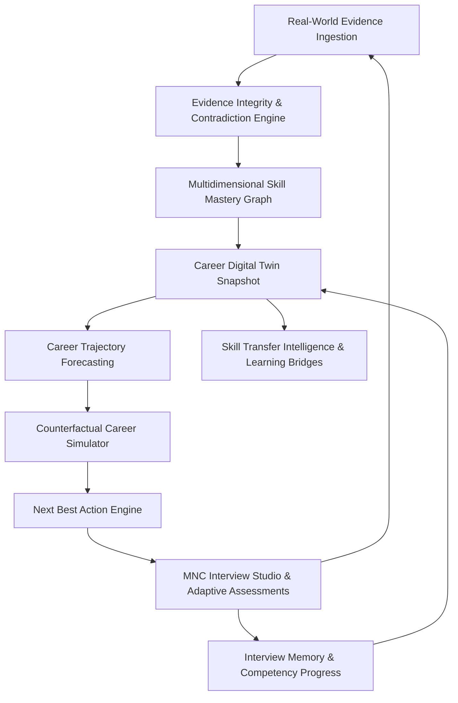

# VIREONIQ X — Canonical System & Data Architecture

## 1. System Overview

VIREONIQ X is an evidence-driven career and workforce intelligence operating system. It eliminates fractured career data by enforcing a single, unified, closed-loop dependency graph:

$$\text{PERSON} \rightarrow \text{GOAL} \rightarrow \text{SKILL} \rightarrow \text{EVIDENCE} \rightarrow \text{ASSESSMENT} \rightarrow \text{READINESS} \rightarrow \text{ROLE} \rightarrow \text{OPPORTUNITY} \rightarrow \text{ACTION} \rightarrow \text{OUTCOME}$$

---

## 2. Closed-Loop Career Intelligence Architecture

### Core Subsystems & Engines

1. **Evidence Integrity & Contradiction Engine (`services/evidence_graph_service.py`)**:
   - Manages 10 normalized evidence states: `CLAIMED`, `OBSERVED`, `INFERRED`, `DEMONSTRATED`, `ASSESSED`, `VERIFIED`, `CONFLICTED`, `NEEDS_REVIEW`, `EXPIRED`.
   - Multi-factor integrity scoring: `claim_strength`, `observed_strength`, `demonstrated_strength`, `assessment_strength`, `source_reliability`, `evidence_freshness`, `cross_source_consistency`, and `conflict_score`.
   - Structured, non-accusatory Evidence Conflict Cards with explicit resolution paths.
   - Temporal decay curve: $F(t) = 100 \cdot e^{-0.04t}$ with category-specific baseline stability constants.

2. **Multidimensional Skill Mastery & Prerequisite Bottlenecks (`services/canonical_skill_service.py`)**:
   - Decomposes canonical skills into 7–9 granular sub-dimensions (e.g., Python: Syntax, Algorithms, Concurrency, APIs, Testing, Performance, Production Readiness).
   - Strict prerequisite dependency tree with backwards traversal algorithm finding root unfulfilled foundational skills before recommending advanced topics.

3. **Career Digital Twin 2.0 (`services/career_digital_twin_service.py`)**:
   - Synthesizes candidate skills, projects, assessments, evidence integrity, trajectory, and readiness into an explainable snapshot.
   - `compute_twin_diff()` and `get_career_twin_change_feed()` provide transparent input deltas and explainable narrative ("What changed?" and "Why did it change?").

4. **Career Trajectory Forecasting (`services/career_readiness_engine.py`)**:
   - Computes 3, 6, and 12-month projections across `Most Likely`, `Optimistic`, and `Risk-Adjusted` scenario bounds.
   - Projections dynamically scale based on verified learning hours per week and empirical learning velocity.

5. **Counterfactual Career Simulator (`services/counterfactual_simulation_service.py`)**:
   - Isolated counterfactual sandbox enabling zero-mutation career trajectory exploration.
   - Supports granular *"What if I..."* decisions (`LEARN_SKILL`, `IMPROVE_DSA`, `BUILD_PROJECTS`, `CLOUD_CERT`, `PIVOT_ROLE`, `INCREASE_HOURS`).
   - Side-by-side multi-path comparison matrix with calculated ROI efficiency ratios.

6. **Skill Transfer Intelligence (`services/role_intelligence_service.py`)**:
   - Quantifies role transferability percentage, foundation overlap, missing critical skills, and estimated bridge difficulty.

7. **Cross-Session Interview Memory & MNC Interview Studio (`services/mnc_interview_intelligence_service.py`)**:
   - Tracks competency evolution over historical sessions (e.g. System Design: 54 -> 68 (+14 pts)).
   - Dynamically selects next question difficulty (EASY / MEDIUM / HARD / VERY_HARD) calibrated to real-time performance and historical weaknesses.
   - Generates 8-round company blueprints based on public role requirements and public interview patterns.
   - Deterministic AST analysis evaluates code correctness, Big-O runtime, and space complexity.

8. **Autonomous Career OS (`services/career_intervention_engine.py`)**:
   - Computes Next Best Action (NBA) prioritizing evidence conflict resolutions and root prerequisite bottlenecks.
   - Autonomy Level 3 guardrails: High-impact actions (`APPLY_JOB`, `MESSAGE_RECRUITER`, `PUBLISH_CREDENTIAL`, `CHANGE_GOAL`) require user confirmation.

9. **Career Decision Explainability Engine (`services/career_decision_explainability_service.py`)**:
   - Provides evidence-backed, transparent, structured explanations for every major recommendation.
   - Exposes recommendation, reasons, supporting evidence, identified gaps, role requirements, market signals, expected impact ranges (without false precision), effort, confidence, assumptions, and alternatives.

---

## 3. Database Schema Overview

The relational PostgreSQL database models (defined in `backend/db/models.py`) include:
- **Identity & Profiles**: `User`, `Role`, `Profile`, `Company`, `Institution`.
- **Evidence & Skills**: `SkillEvidence`, `ProjectEvidence`, `EvidenceItem`, `EvidenceDispute`.
- **Assessments & Interviews**: `AssessmentSession`, `AssessmentEvaluationResult`, `MNCCompanyInterviewProfile`, `MNCQuestionBlueprint`, `MNCCodingQuestion`, `MNCInterviewSession`, `MNCInterviewTurn`.
- **Readiness & Goals**: `CareerReadinessScore`, `CareerGoal`, `CareerGoalRecord`, `NextBestAction`.
- **Talent Passport & Verifications**: `VerifiedCredential`, `CredentialAuditLog`, `TalentPassportPublicView`.
- **Audit & Intelligence Receipts**: `IntelligenceReceipt`, `AuditLog`.
